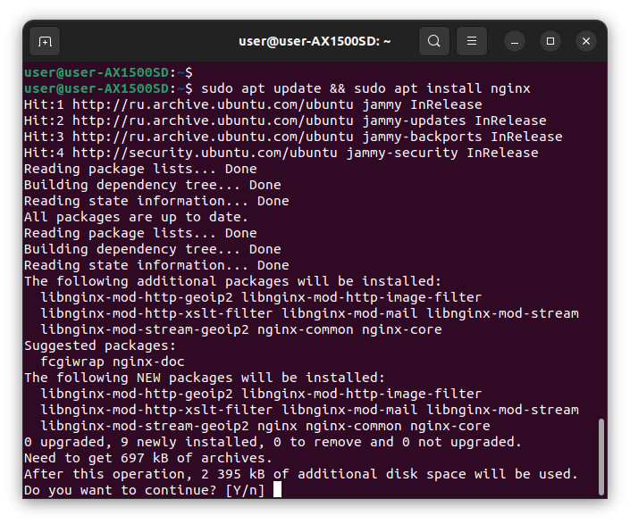
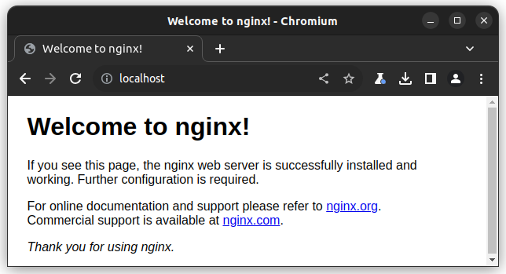
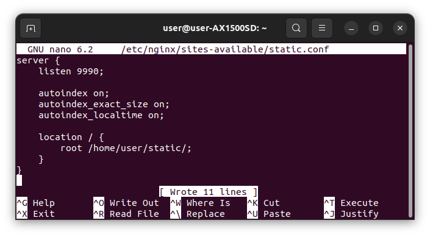
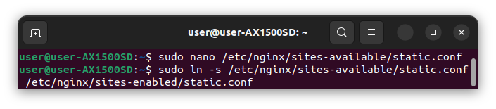
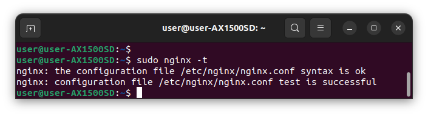
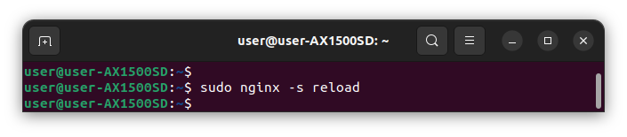
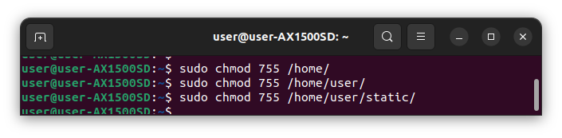
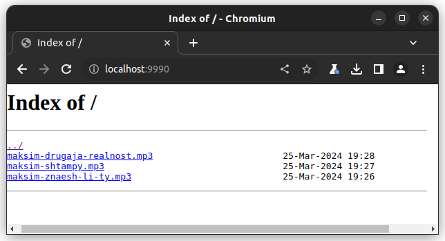
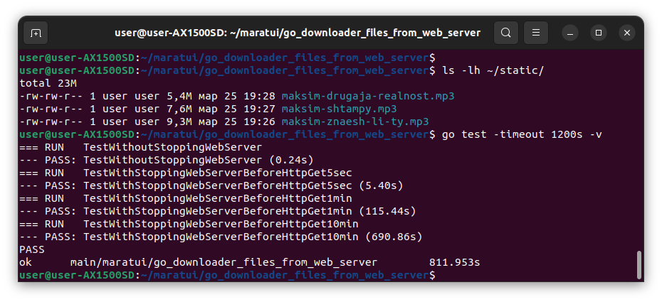
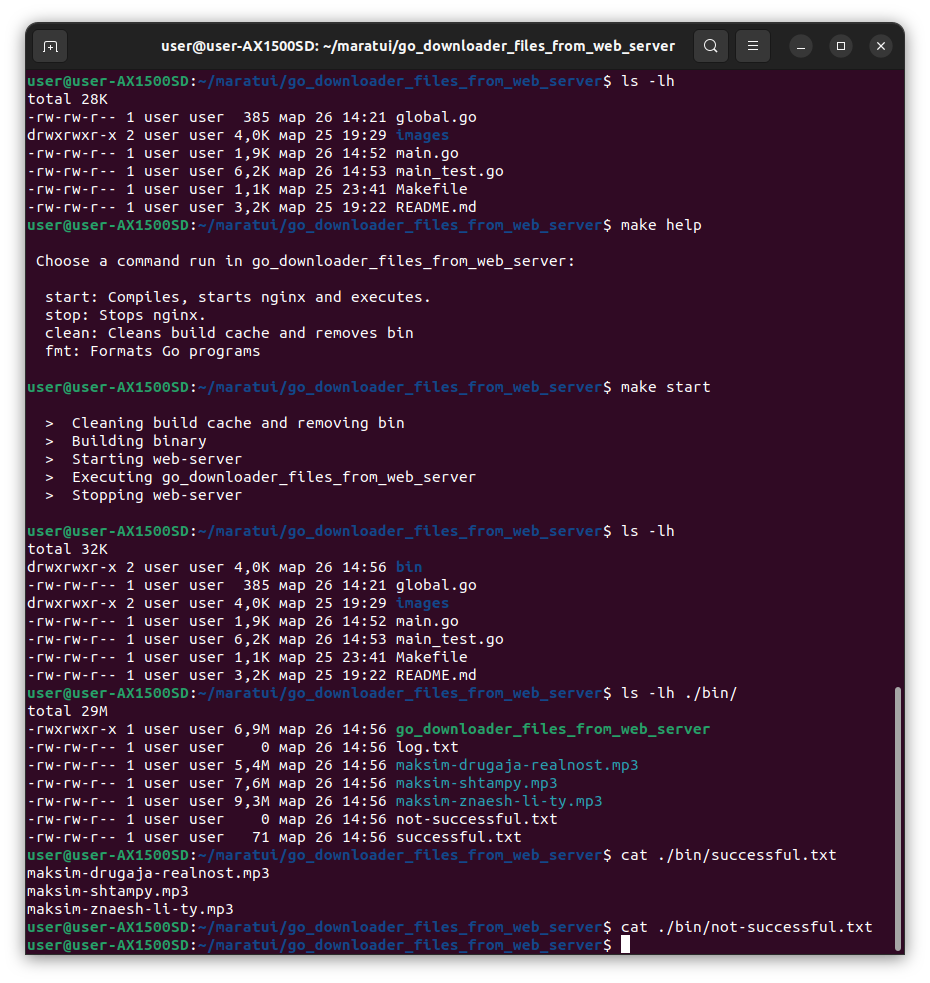

# go_downloader_files_from_web_server

### Задание
```
Есть веб сервер, который хостит статичные файлы. Например mp3 файлы. (Можно
использовать apache, nginx, IIS сервер или любой другой).
Наше приложение на Go должно уметь скачивать целую папку с веб сервера (т.е.
загрузить все файлы по http и сохранить в локальную папку).
Алгоритм работы приложения:
1. Пытаемся скачать файл и сохранить в локальную папку.
2. Если связь прервалась (например вы временно остановили веб сервер
(эмуляция “интернет пропал”) - происходит пауза 5 секунд и после этого
приложение повторно пытается загрузить этот файл с сервера и сохранить.
Если программе не удается 12 раз скачать файл (между каждой попыткой пауза
5 секунд), то делается пауза 1 минута. Через 1 минуту снова делается одна
попытка скачать. Если не удаётся снова, тогда повторно пауза. После 10 минут
(с момента активных попыток загрузки файлов) прекращаем попытку загрузить
этот файл
3. Пункт 2 выполняем для каждого следующего файла.
В результат работы программы сохраняем 2 лог файла: successful.txt - в нём каждая
строка - успешно скачанный файл. not-successful.txt файл - в нем в каждой строчке не
скачанный файл.
```
### Выполнение задания

- Перед началом работы необходимо установить веб-сервер nginx: \
`sudo apt update && sudo apt install nginx` \
 \


- Создаем конфигурации нашего веб-сервера: \
`sudo nano /etc/nginx/sites-available/static.conf` \


- Создаем символическую ссылку: \
`sudo ln -s /etc/nginx/sites-available/static.conf /etc/nginx/sites-enabled/static.conf` \


- Проверяем: \
`sudo nginx -t` \


- Перезагружаем: \
`sudo nginx -s reload` \


- Необходимо всем директориям по нашему пути поставить права доступа 755: \
 \


### Результаты выполненного задания


